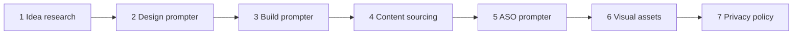

# claude-app-pipeline

> A complete Claude skills pipeline for shipping content-driven Android apps with AdMob — from idea to Play Store.

[](LICENSE)

A pipeline of Claude skills that takes you from "I want to build an app" to a published Play Store listing — idea research, prototype design, .NET MAUI build, content data, ASO copy, visual assets, and privacy policy. Built for solo developers shipping content-driven AdMob apps.

Each skill in stages 2–7 outputs a **prompt** (a markdown file in `outputs/`) that you paste into the appropriate destination tool — Claude.ai with Artifacts, Claude Code, or an image generator. The skill does the structuring, contextualizing, and guardrails; the destination tool does the work.

## The pipeline



```
[1] Idea research     →  outputs/01-idea-research.md          (chosen idea)
[2] Design prompter   →  outputs/02-design-prompt.md          (paste into Claude.ai → UI prototype)
[3] Build prompter    →  outputs/03-build-prompt.md           (paste into Claude Code → built app)
[4] Content sourcing  →  outputs/04-content-prompt.md         (produces app's JSON dataset)
[5] ASO prompter      →  outputs/05-aso-prompt.md             (Play Store listing copy)
[6] Visual assets     →  outputs/06-visual-assets-prompts.md  (icon, feature graphic, screenshots)
[7] Privacy policy    →  outputs/07-privacy-policy-prompt.md  (Play Store-compliant policy)
```

## The skills

| # | Skill | Produces | Triggers on |
|---|-------|----------|-------------|
| 01 | `content-app-idea-research` | A market-validated shortlist of content app ideas (`outputs/01-idea-research.md`) | "find me an app idea", "what should I build", "niche app idea", "AdMob app" |
| 02 | `app-prototype-design-prompter` | A prompt for Claude.ai to build an interactive UI prototype (`outputs/02-design-prompt.md`) | "make a design prompt", "prototype prompt", "design my app" |
| 03 | `app-build-prompter` | A Claude Code prompt that builds the .NET MAUI app (`outputs/03-build-prompt.md`) | "build prompt", "claude code prompt for app", "code the prototype" |
| 04 | `content-data-sourcing-prompter` | A prompt that generates the app's JSON dataset (`outputs/04-content-prompt.md`) | "content prompt", "generate dataset", "data for my app" |
| 05 | `play-store-aso-prompter` | A prompt for Play Store listing copy (`outputs/05-aso-prompt.md`) | "ASO prompt", "Play Store listing", "app description" |
| 06 | `app-visual-assets-prompter` | Image-generation prompts for icon, feature graphic, screenshots (`outputs/06-visual-assets-prompts.md`) | "logo prompt", "feature graphic prompt", "app icon", "screenshots prompt" |
| 07 | `privacy-policy-prompter` | A prompt for a Play Store-compliant privacy policy (`outputs/07-privacy-policy-prompt.md`) | "privacy policy", "data safety", "Play Store privacy" |

## Quickstart

### Install a skill in Claude.ai

1. Grab a packaged skill from [`dist/`](dist/) — e.g. `dist/01-content-app-idea-research.skill`.
2. In Claude.ai: **Settings → Capabilities → Skills → Upload skill**, and select the `.skill` file.
3. The skill triggers automatically when you ask something matching its description.

### Install a skill in Claude Code

Drop the skill folder into a skills directory Claude Code reads:

- **Project scope:** `.claude/skills/<skill-name>/SKILL.md`
- **User scope:** `~/.claude/skills/<skill-name>/SKILL.md`

Copy a folder from [`skills/`](skills/) (e.g. `skills/01-content-app-idea-research/`) into one of those locations. The skill triggers from matching requests.

### Build the `.skill` files yourself

```bash
python scripts/build_all_skills.py
```

This rebuilds [`dist/`](dist/) from [`skills/`](skills/) — validates each `SKILL.md`, zips each folder into `dist/<name>.skill`, and prints a summary.

## Walkthrough — idea to Play Store

1. **Idea** — Ask Claude *"what content app should I build?"* → Skill 01 researches and shortlists ideas → you pick one.
2. **Design** — Say *"make a design prompt"* → Skill 02 writes `outputs/02-design-prompt.md` → paste it into Claude.ai (Artifacts on) → get an interactive UI prototype + a design spec summary.
3. **Build** — Bring the design spec back, say *"make a build prompt"* → Skill 03 writes `outputs/03-build-prompt.md` → run it in Claude Code → it builds the .NET MAUI app with AdMob wired in.
4. **Content** — Say *"make a content prompt"* → Skill 04 writes `outputs/04-content-prompt.md` → run it → get the JSON dataset → spot-check it → host it at your endpoint.
5. **ASO** — Say *"make an ASO prompt"* → Skill 05 writes `outputs/05-aso-prompt.md` → run it → get policy-compliant title and descriptions for Play Console.
6. **Visuals** — Say *"make a visual assets prompt"* → Skill 06 writes `outputs/06-visual-assets-prompts.md` → run each prompt in an image generator → get icon, feature graphic, screenshot designs.
7. **Privacy** — Say *"make a privacy policy prompt"* → Skill 07 writes `outputs/07-privacy-policy-prompt.md` → run it → host the HTML policy, fill the Data Safety form to match.
8. **Ship** — Upload the signed AAB, listing copy, visuals, and privacy URL to the Play Console. Submit.

## Setting up the GitHub repo

When you push this to GitHub, configure these in the repo settings:

**Description** (paste into the GitHub repo description field — under 350 chars):

> A pipeline of Claude skills that takes you from "I want to build an app" to a published Play Store listing — idea research, prototype design, .NET MAUI build, content data, ASO copy, visual assets, and privacy policy. Built for solo developers shipping content-driven AdMob apps.

**Topics** (paste into the GitHub repo topics field):

`claude`, `claude-skills`, `claude-ai`, `anthropic`, `dotnet-maui`, `android`, `admob`, `play-store`, `app-development`, `indie-dev`, `mobile-app`, `aso`

## Contributing

Issues and suggestions welcome — open an [issue](../../issues) for bugs, skill improvements, or new pipeline stages.

## License

[MIT](LICENSE).

## About

Built for use with [Claude](https://claude.ai), made by [Anthropic](https://www.anthropic.com). This is a community project and is **not affiliated with or endorsed by Anthropic**. For the official skills format, see Anthropic's documentation: <https://docs.claude.com/en/docs/agents-and-tools/agent-skills/overview>
